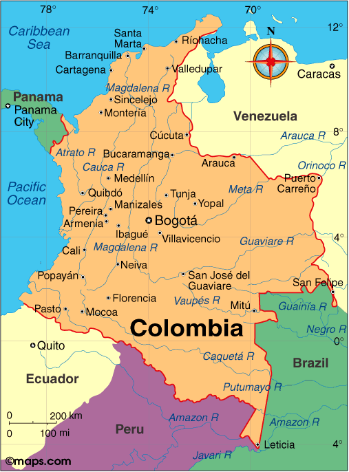

About Colombia
==============

(Source - Wikipedia)

Colombia is a country in South America with an insular region in North America. 
It is bordered by the Caribbean Sea to the north, Venezuela to the east, 
Brazil to the southeast, Ecuador and Peru to the south, the Pacific Ocean to the west and 
Panama to the northwest. Colombia comprises 32 departments and the Capital District of Bogotá, 
the country's largest city. It covers an area of 1,141,748 square kilometers (440,831 sq mi), with a population of 50 million.

The geography of Colombia is characterized by its six main natural regions that 
present their own unique characteristics, from the Andes mountain range region 
shared with Ecuador and Venezuela; the Pacific Coastal region shared with Panama and Ecuador; 
the Caribbean coastal region shared with Venezuela and Panama; the Llanos (plains) 
shared with Venezuela; the Amazon rainforest region shared with Venezuela, Brazil, 
Peru and Ecuador; to the insular area, comprising islands in both the Atlantic and Pacific oceans
Belize is highly forested, with more than 50% of the mainland covered with forests, 
and the remaining land consisting mainly of agriculture, arable
land, and human settlements.

Colombia is the second most biologically diverse country on Earth. This biodiversity results 
from Colombia's varied ecosystems—from the rich tropical rainforest to the coastal cloud 
forests to the open savannas

   Image source https://geology.com/world/belize-satellite-image.shtml
